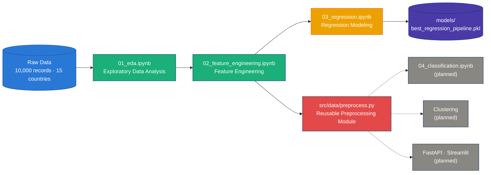
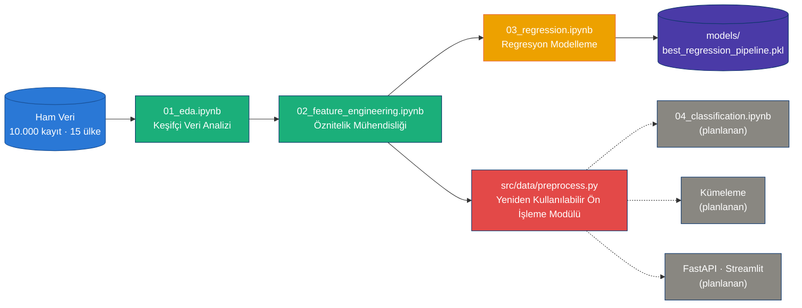

<a id="readme-top"></a>

<div align="center">

<picture>
  <source media="(prefers-color-scheme: dark)" srcset="https://capsule-render.vercel.app/api?type=waving&color=0:184F95,100:0D366B&height=200&section=header&text=Mobile%20Usage%20%26%20Digital%20Wellbeing&fontSize=38&fontColor=FFFFFF&fontAlignY=35&animation=fadeIn&desc=End-to-End%20Data%20Science%20%26%20Machine%20Learning%20Pipeline&descAlignY=55&descSize=16" />
  <source media="(prefers-color-scheme: light)" srcset="https://capsule-render.vercel.app/api?type=waving&color=0:2A78D6,100:1BAF7A&height=200&section=header&text=Mobile%20Usage%20%26%20Digital%20Wellbeing&fontSize=38&fontColor=FFFFFF&fontAlignY=35&animation=fadeIn&desc=End-to-End%20Data%20Science%20%26%20Machine%20Learning%20Pipeline&descAlignY=55&descSize=16" />
  
</picture>

<picture>
  <source media="(prefers-color-scheme: dark)" srcset="https://readme-typing-svg.demolab.com/?font=Fira+Code&weight=600&size=20&pause=1200&color=6DA7EC&background=00000000&center=true&vCenter=true&width=750&lines=Predicting+screen+time+%26+digital+wellbeing+signals;EDA+%E2%86%92+Feature+Engineering+%E2%86%92+Regression+%E2%86%92+...;Leakage-safe%2C+reusable%2C+production-style+pipeline" />
  <source media="(prefers-color-scheme: light)" srcset="https://readme-typing-svg.demolab.com/?font=Fira+Code&weight=600&size=20&pause=1200&color=184F95&background=00000000&center=true&vCenter=true&width=750&lines=Predicting+screen+time+%26+digital+wellbeing+signals;EDA+%E2%86%92+Feature+Engineering+%E2%86%92+Regression+%E2%86%92+...;Leakage-safe%2C+reusable%2C+production-style+pipeline" />
  
</picture>

<br/>

[](https://github.com/buraksal52/end_to_end_mobile_usage_ml/commits/main)
[](https://github.com/buraksal52/end_to_end_mobile_usage_ml)


### 🌐 Choose your language / Dil seçiniz

<a href="#english"></a>
&nbsp;&nbsp;
<a href="#turkce"></a>

<sub>Click a badge to jump to that language, then click the section header below to expand it. · Bir rozete tıklayarak o dile atlayın, ardından aşağıdaki başlığa tıklayarak genişletin.</sub>

</div>

---

<a id="english"></a>

<details open>
<summary><h2>🇬🇧 English</h2></summary>

### 📑 Table of Contents

- [Overview](#overview)
- [Problem Statement](#problem-statement)
- [Solution & Approach](#solution--approach)
- [Dataset](#dataset)
- [Pipeline Architecture](#pipeline-architecture)
- [Repository Structure](#repository-structure)
- [Key Results](#key-results)
- [Project Roadmap](#project-roadmap)
- [Getting Started](#getting-started)
- [Usage Example](#usage-example)
- [Tech Stack](#tech-stack)
- [License](#license)
- [Author](#author)

---

### Overview

This repository is an **end-to-end, production-oriented data science & machine learning project** built around a mobile application usage dataset — **10,000 user records across 15 countries (2022–2024)**, covering usage behavior, device/platform data, monetization signals, and self-reported digital-wellbeing indicators.

The project moves deliberately from **research** (notebooks) to **production-quality code** (`src/`): every notebook is treated as a validated experiment, and only decisions that survive scrutiny (distribution checks, correlation analysis, leakage checks, target-relationship tests) get promoted into reusable modules.

### Problem Statement

Product and growth teams routinely ask three questions that are harder than they look:

1. **How much are people actually using the app**, and what usage patterns (sessions, device, category, connectivity) explain that?
2. **Can we predict daily screen time** from measurable behavioral and contextual signals, accurately enough to be useful?
3. **Do self-reported wellbeing signals** (perceived mental-health impact, screen-time concern) reflect **actual measured behavior** — or are teams at risk of over-trusting a survey question?

This project answers all three with real evidence rather than assumption — including the uncomfortable finding (documented, not hidden) that self-reported concern and measured usage are **almost uncorrelated** in this dataset, a pattern consistent with partially synthetic data. That finding materially changes what should — and shouldn't — be modeled next.

### Solution & Approach

A four-stage pipeline, each stage validated before the next is built:

1. **`01_eda.ipynb`** — full data-quality audit, univariate/multivariate analysis, temporal trends, correlation & hypothesis testing, and a dedicated digital-wellbeing deep dive.
2. **`02_feature_engineering.ipynb`** — 24 candidate features generated across five families (usage ratios, monetization, ordinal encodings, temporal, categorical/composite). Every candidate is checked against its **distribution, multicollinearity, and relationship to the target** — weak or redundant features are explicitly dropped rather than accumulated. (Only 3 survived elimination for the reinstall target — a deliberately honest result, not a bug.)
3. **`03_regression.ipynb`** — predicts daily screen time (hours) using a leakage-safe `ColumnTransformer` pipeline, 6 baseline algorithms, `RandomizedSearchCV` tuning on the top 2, full MAE/RMSE/R² comparison, residual & error analysis, and a saved model artifact.
4. **`src/data/preprocess.py`** — the validated preprocessing decisions extracted into a single, reusable, unit-tested module: the same entry point that classification, clustering, the FastAPI service, the Streamlit app, and batch inference will all call — no duplicated logic.

### Dataset

| | |
|---|---|
| Source file | `data/raw/mobile_app_usage_screen_time.csv` |
| Records | 10,000 |
| Countries | 15 |
| Time span | 2022 – 2024 |
| Raw columns | 34 (usage behavior, device/platform, demographics, monetization, self-reported wellbeing) |
| Missing data | Only `sleep_disruption_from_phone` (~27.7%) — kept as its own category, never silently imputed away |
| Duplicate records | None |

> **Honesty note:** Both the EDA and feature-engineering notebooks found that self-reported wellbeing fields (mental-health impact, screen-time concern) and the reinstall-behavior target correlate only weakly with every measured usage variable (Cramér's V / point-biserial r mostly below 0.05) — a pattern consistent with these labels being at least partially synthetic/independently generated. This is reported transparently because it directly affects which modeling targets are worth pursuing next.

### Pipeline Architecture



### Repository Structure

```text
product_level_mobile/
├── data/
│   ├── raw/                          # Original, untouched source data
│   │   └── mobile_app_usage_screen_time.csv
│   └── processed/                    # Output of 02_feature_engineering.ipynb
│       └── mobile_app_usage_features.csv
├── notebooks/
│   ├── 01_eda.ipynb                  # Exploratory data analysis
│   ├── 02_feature_engineering.ipynb  # Candidate features, validated & pruned
│   └── 03_regression.ipynb           # Regression modeling & evaluation
├── models/
│   └── best_regression_pipeline.pkl  # Saved winning pipeline (preprocessing + model)
├── src/
│   └── data/
│       └── preprocess.py             # Reusable, tested preprocessing entry point
├── requirements.txt
└── README.md
```

### Key Results

**Regression — predicting daily screen time (hours):**

| Rank | Model | MAE (h) | RMSE (h) | R² |
|:---:|---|---:|---:|---:|
| 🥇 | **Gradient Boosting** | **0.605** | **0.941** | **0.393** |
| 🥈 | Gradient Boosting (Tuned) | 0.607 | 0.942 | 0.392 |
| 🥉 | Linear Regression | 0.618 | 0.946 | 0.387 |
| 4 | Ridge | 0.617 | 0.946 | 0.387 |
| 5 | Random Forest (Tuned) | 0.617 | 0.947 | 0.385 |
| 6 | Lasso | 0.621 | 0.952 | 0.379 |
| 7 | Random Forest | 0.622 | 0.960 | 0.369 |
| 8 | Decision Tree | 0.632 | 1.009 | 0.303 |

- Error analysis shows prediction error **grows with actual screen time** (heavy-tail effect) and is **highest for Social Media** and **lowest for Finance/Banking** app categories.
- Feature engineering: **24 candidate features** were generated and rigorously tested against the reinstall target — only **3** survived elimination (effect-size-based, not p-value-based, to avoid the large-*n* significance trap). This is reported as a finding about the data, not treated as a failure.

### Project Roadmap

| Phase | Status |
|---|:---:|
| 01 · Exploratory Data Analysis | ✅ Done |
| 02 · Feature Engineering | ✅ Done |
| 03 · Regression Modeling | ✅ Done |
| `src/data/preprocess.py` — reusable preprocessing | ✅ Done |
| 04 · Classification (reinstall prediction) | 🔜 Planned |
| Clustering (behavioral user segmentation) | 🔜 Planned |
| FastAPI inference service | 🔜 Planned |
| Streamlit interactive app | 🔜 Planned |
| Docker packaging & deployment | 🔜 Planned |

### Getting Started

```bash
# 1. Clone the repository
git clone https://github.com/buraksal52/end_to_end_mobile_usage_ml.git
cd end_to_end_mobile_usage_ml

# 2. Create and activate a virtual environment
python -m venv .venv
source .venv/bin/activate        # Windows: .venv\Scripts\activate

# 3. Install dependencies
pip install -r requirements.txt

# 4. Launch Jupyter and run the notebooks in order
jupyter lab
#   01_eda.ipynb  ->  02_feature_engineering.ipynb  ->  03_regression.ipynb
```

### Usage Example

`src/data/preprocess.py` is designed to be imported directly — no need to repeat any notebook logic:

```python
from src.data.preprocess import prepare_dataset

# Loads the processed dataset, splits features/target, auto-detects
# numerical/categorical columns, and builds an unfitted ColumnTransformer.
prepared = prepare_dataset(target="screen_time_hours")

prepared.preprocessor.fit(prepared.X_train)
X_train_transformed = prepared.preprocessor.transform(prepared.X_train)

print(X_train_transformed.shape)
print(f"Numerical features:   {len(prepared.numerical_features)}")
print(f"Categorical features: {len(prepared.categorical_features)}")
```

### Tech Stack


### License

Released under the **MIT License** — see [`LICENSE`](LICENSE). *(Adjust this section if a different license is preferred.)*

### Author

Built and maintained by **[@buraksal52](https://github.com/buraksal52)**.

<div align="right"><a href="#readme-top">⬆ back to top</a></div>

</details>

---

<a id="turkce"></a>

<details>
<summary><h2>🇹🇷 Türkçe</h2></summary>

### 📑 İçindekiler

- [Genel Bakış](#genel-bakış)
- [Problem Tanımı](#problem-tanımı)
- [Çözüm ve Yaklaşım](#çözüm-ve-yaklaşım)
- [Veri Seti](#veri-seti)
- [Pipeline Mimarisi](#pipeline-mimarisi)
- [Depo Yapısı](#depo-yapısı)
- [Öne Çıkan Sonuçlar](#öne-çıkan-sonuçlar)
- [Proje Yol Haritası](#proje-yol-haritası)
- [Başlarken](#başlarken)
- [Kullanım Örneği](#kullanım-örneği)
- [Teknoloji Yığını](#teknoloji-yığını)
- [Lisans](#lisans)
- [Yazar](#yazar)

---

### Genel Bakış

Bu depo, bir mobil uygulama kullanım veri seti üzerine inşa edilmiş **uçtan uca, üretim odaklı bir veri bilimi ve makine öğrenmesi projesidir** — **15 ülkeden 10.000 kullanıcı kaydı (2022–2024)**, kullanım davranışı, cihaz/platform bilgisi, gelir (monetization) sinyalleri ve kullanıcıların kendi bildirdiği dijital refah göstergelerini kapsıyor.

Proje, **araştırma** aşamasından (defterler/notebooks) **üretim kalitesinde koda** (`src/`) bilinçli olarak kademeli ilerliyor: her defter doğrulanmış bir deney olarak ele alınıyor ve yalnızca titiz bir incelemeden (dağılım kontrolü, korelasyon analizi, veri sızıntısı kontrolü, hedefle ilişki testi) geçen kararlar yeniden kullanılabilir modüllere terfi ediyor.

### Problem Tanımı

Ürün ve büyüme ekipleri sık sık, göründüğünden daha zor üç soru sorar:

1. **Kullanıcılar uygulamayı gerçekte ne kadar kullanıyor** ve bunu hangi kullanım örüntüleri (oturum, cihaz, kategori, bağlantı tipi) açıklıyor?
2. **Günlük ekran süresini**, ölçülebilir davranışsal ve bağlamsal sinyallerden, işe yarar bir doğrulukla **tahmin edebilir miyiz**?
3. **Kendi bildirilen refah sinyalleri** (algılanan ruh sağlığı etkisi, ekran süresi endişesi) **gerçekte ölçülen davranışı** yansıtıyor mu — yoksa ekipler bir anket sorusuna fazla mı güveniyor?

Bu proje, üç soruyu da varsayım yerine gerçek kanıtla yanıtlıyor — kendi bildirilen endişe ile ölçülen kullanımın bu veri setinde **neredeyse ilişkisiz** çıktığı (kısmen sentetik veriyle tutarlı bir örüntü) rahatsız edici ama **saklanmayan, açıkça raporlanan** bulgu dahil. Bu bulgu, bundan sonra hangi hedeflerin modellenmeye değer olduğunu doğrudan değiştiriyor.

### Çözüm ve Yaklaşım

Her aşama bir sonraki inşa edilmeden önce doğrulanan dört aşamalı bir pipeline:

1. **`01_eda.ipynb`** — tam veri kalitesi denetimi, tek/çok değişkenli analiz, zamansal eğilimler, korelasyon & hipotez testleri ve ayrı bir dijital refah derinlemesine incelemesi.
2. **`02_feature_engineering.ipynb`** — beş grupta (kullanım oranları, parasal göstergeler, ordinal kodlamalar, zamansal, kategorik/bileşik) 24 aday öznitelik türetildi. Her aday, **dağılımı, çoklu doğrusallığı ve hedefle ilişkisi** açısından test edildi — zayıf/gereksiz öznitelikler biriktirilmek yerine açıkça elendi. (Reinstall hedefi için yalnızca 3 öznitelik hayatta kaldı — bilinçli olarak dürüst bir sonuç, hata değil.)
3. **`03_regression.ipynb`** — günlük ekran süresini (saat) sızıntısız bir `ColumnTransformer` pipeline'ı, 6 temel algoritma, en iyi 2 model üzerinde `RandomizedSearchCV` optimizasyonu, tam MAE/RMSE/R² karşılaştırması, artık/hata analizi ve kaydedilmiş bir model artefaktı ile tahmin ediyor.
4. **`src/data/preprocess.py`** — doğrulanmış ön işleme kararlarının tek, yeniden kullanılabilir, test edilmiş bir modülde toplanmış hali: sınıflandırma, kümeleme, FastAPI servisi, Streamlit uygulaması ve toplu (batch) çıkarımın hepsinin çağıracağı aynı giriş noktası — hiçbir mantık tekrarlanmıyor.

### Veri Seti

| | |
|---|---|
| Kaynak dosya | `data/raw/mobile_app_usage_screen_time.csv` |
| Kayıt sayısı | 10.000 |
| Ülke sayısı | 15 |
| Zaman aralığı | 2022 – 2024 |
| Ham sütun sayısı | 34 (kullanım davranışı, cihaz/platform, demografi, gelir, kendi bildirilen refah) |
| Eksik veri | Yalnızca `sleep_disruption_from_phone` (~%27.7) — sessizce doldurulmuyor, kendi kategorisi olarak korunuyor |
| Yinelenen kayıt | Yok |

> **Dürüstlük notu:** Hem EDA hem de öznitelik mühendisliği defterleri, kendi bildirilen refah alanlarının (ruh sağlığı etkisi, ekran süresi endişesi) ve reinstall davranışı hedefinin, ölçülen hemen hemen her kullanım değişkeniyle yalnızca zayıf ilişkili olduğunu buldu (Cramér's V / point-biserial r çoğunlukla 0.05'in altında) — bu, söz konusu etiketlerin en azından kısmen sentetik/bağımsız üretilmiş olabileceğiyle tutarlı bir örüntü. Bu, bundan sonra hangi modelleme hedeflerinin peşinden gidilmeye değer olduğunu doğrudan etkilediği için şeffafça raporlanıyor.

### Pipeline Mimarisi



### Depo Yapısı

```text
product_level_mobile/
├── data/
│   ├── raw/                          # Orijinal, dokunulmamış kaynak veri
│   │   └── mobile_app_usage_screen_time.csv
│   └── processed/                    # 02_feature_engineering.ipynb çıktısı
│       └── mobile_app_usage_features.csv
├── notebooks/
│   ├── 01_eda.ipynb                  # Keşifçi veri analizi
│   ├── 02_feature_engineering.ipynb  # Aday öznitelikler, doğrulanmış & elenmiş
│   └── 03_regression.ipynb           # Regresyon modelleme & değerlendirme
├── models/
│   └── best_regression_pipeline.pkl  # Kaydedilmiş kazanan pipeline (ön işleme + model)
├── src/
│   └── data/
│       └── preprocess.py             # Yeniden kullanılabilir, test edilmiş ön işleme modülü
├── requirements.txt
└── README.md
```

### Öne Çıkan Sonuçlar

**Regresyon — günlük ekran süresi (saat) tahmini:**

| Sıra | Model | MAE (sa) | RMSE (sa) | R² |
|:---:|---|---:|---:|---:|
| 🥇 | **Gradient Boosting** | **0.605** | **0.941** | **0.393** |
| 🥈 | Gradient Boosting (Tuned) | 0.607 | 0.942 | 0.392 |
| 🥉 | Linear Regression | 0.618 | 0.946 | 0.387 |
| 4 | Ridge | 0.617 | 0.946 | 0.387 |
| 5 | Random Forest (Tuned) | 0.617 | 0.947 | 0.385 |
| 6 | Lasso | 0.621 | 0.952 | 0.379 |
| 7 | Random Forest | 0.622 | 0.960 | 0.369 |
| 8 | Decision Tree | 0.632 | 1.009 | 0.303 |

- Hata analizi, tahmin hatasının **gerçek ekran süresi arttıkça büyüdüğünü** (ağır kuyruk etkisi) ve en yüksek hatanın **Social Media**, en düşük hatanın **Finance/Banking** kategorisinde olduğunu gösteriyor.
- Öznitelik mühendisliği: **24 aday öznitelik** türetildi ve reinstall hedefine karşı titizlikle test edildi — yalnızca **3 tanesi** elemeyi geçti (büyük örneklemdeki p-değeri tuzağına düşmemek için p-değeri değil, etki büyüklüğü esas alındı). Bu, bir başarısızlık değil, veri hakkında bir bulgu olarak raporlanıyor.

### Proje Yol Haritası

| Aşama | Durum |
|---|:---:|
| 01 · Keşifçi Veri Analizi | ✅ Tamamlandı |
| 02 · Öznitelik Mühendisliği | ✅ Tamamlandı |
| 03 · Regresyon Modelleme | ✅ Tamamlandı |
| `src/data/preprocess.py` — yeniden kullanılabilir ön işleme | ✅ Tamamlandı |
| 04 · Sınıflandırma (reinstall tahmini) | 🔜 Planlanıyor |
| Kümeleme (davranışsal kullanıcı segmentasyonu) | 🔜 Planlanıyor |
| FastAPI çıkarım servisi | 🔜 Planlanıyor |
| Streamlit etkileşimli uygulama | 🔜 Planlanıyor |
| Docker paketleme & dağıtım | 🔜 Planlanıyor |

### Başlarken

```bash
# 1. Depoyu klonlayın
git clone https://github.com/buraksal52/end_to_end_mobile_usage_ml.git
cd end_to_end_mobile_usage_ml

# 2. Sanal ortam oluşturup etkinleştirin
python -m venv .venv
source .venv/bin/activate        # Windows: .venv\Scripts\activate

# 3. Bağımlılıkları kurun
pip install -r requirements.txt

# 4. Jupyter'ı başlatın ve defterleri sırayla çalıştırın
jupyter lab
#   01_eda.ipynb  ->  02_feature_engineering.ipynb  ->  03_regression.ipynb
```

### Kullanım Örneği

`src/data/preprocess.py`, hiçbir defter mantığını tekrarlamadan doğrudan import edilecek şekilde tasarlandı:

```python
from src.data.preprocess import prepare_dataset

# İşlenmiş veri setini yükler, öznitelik/hedefi ayırır, sayısal/kategorik
# sütunları otomatik tespit eder ve fit edilmemiş bir ColumnTransformer kurar.
prepared = prepare_dataset(target="screen_time_hours")

prepared.preprocessor.fit(prepared.X_train)
X_train_transformed = prepared.preprocessor.transform(prepared.X_train)

print(X_train_transformed.shape)
print(f"Sayısal öznitelik sayısı   : {len(prepared.numerical_features)}")
print(f"Kategorik öznitelik sayısı : {len(prepared.categorical_features)}")
```

### Teknoloji Yığını


### Lisans

**MIT Lisansı** ile yayınlanmıştır — bkz. [`LICENSE`](LICENSE). *(Farklı bir lisans tercih edilirse bu bölüm güncellenmelidir.)*

### Yazar

**[@buraksal52](https://github.com/buraksal52)** tarafından geliştirilmekte ve sürdürülmektedir.

<div align="right"><a href="#readme-top">⬆ başa dön</a></div>

</details>

---

<div align="center">

<picture>
  <source media="(prefers-color-scheme: dark)" srcset="https://capsule-render.vercel.app/api?type=waving&color=0:184F95,100:0D366B&height=120&section=footer" />
  <source media="(prefers-color-scheme: light)" srcset="https://capsule-render.vercel.app/api?type=waving&color=0:2A78D6,100:1BAF7A&height=120&section=footer" />
  
</picture>

<sub>Made with ❤️ and 🐍 by <a href="https://github.com/buraksal52">@buraksal52</a></sub>

</div>
